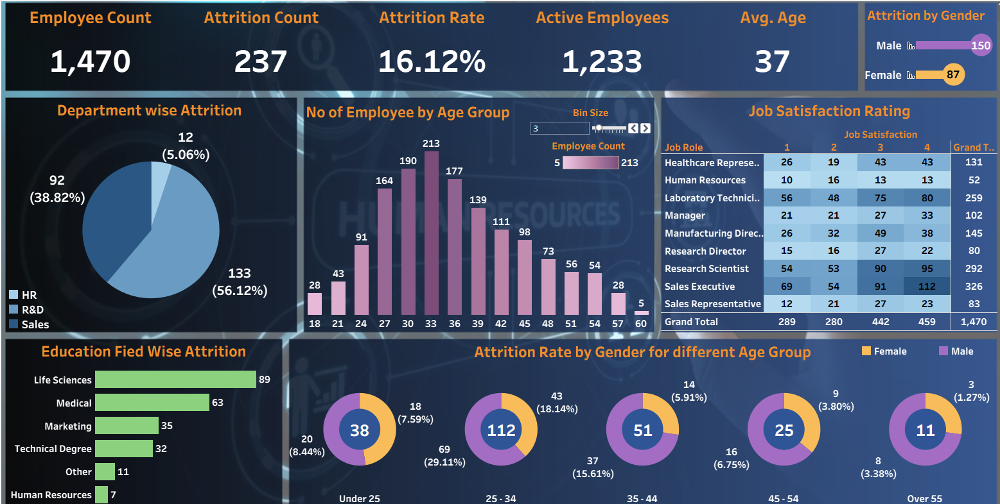

## 📊 HR Analytics Dashboard – Data Analytics Project
## 📌 Project Overview

The HR Analytics Dashboard is an interactive data visualization project built to analyze workforce data and uncover insights related to employee attrition, demographics, and organizational trends.

This dashboard enables HR teams and business leaders to make data-driven decisions by identifying patterns in employee behavior, retention, and workforce distribution.

## 🌐 Live Interactive Dashboard

🔎 Explore the dashboard here:
👉 https://app.powerbi.com/groups/me/reports/de95a1f6-1a09-4684-aef8-07575698886a/13c8a28c0aaded4d190a?experience=power-bi

## 🎯 Objectives

Analyze overall employee count and attrition rate

Identify attrition trends by department, job role, and gender

Understand workforce distribution by age group and education field

Evaluate key HR metrics to support retention strategies

Build an interactive and user-friendly dashboard for business insights

## 📊 Key Dashboard Features

✔ KPI Cards (Total Employees, Attrition Rate, Active Employees)
✔ Attrition analysis by Department & Job Role
✔ Gender-wise employee distribution
✔ Age group analysis
✔ Education field breakdown
✔ Interactive filters for dynamic analysis

## 🛠️ Tools & Technologies Used

Power BI

Microsoft Excel (Data Cleaning & Preparation)

HR Dataset (Workforce Data)

## 📂 Project Structure
HR-Analytics-Tableau-Dashboard/
```
│
├── dashboard/        
├── data/             
├── screenshots/      
└── README.md
```       

## 📸 Dashboard Preview


## 📈 Business Insights Derived

Departments with the highest attrition rate

Age group most likely to leave the organization

Job roles with higher employee turnover

Gender distribution across departments

Workforce experience trends

## 👨‍💻 Author

ManiKantan P
Business Analyst | Power BI | Tableau | SQL | Python
